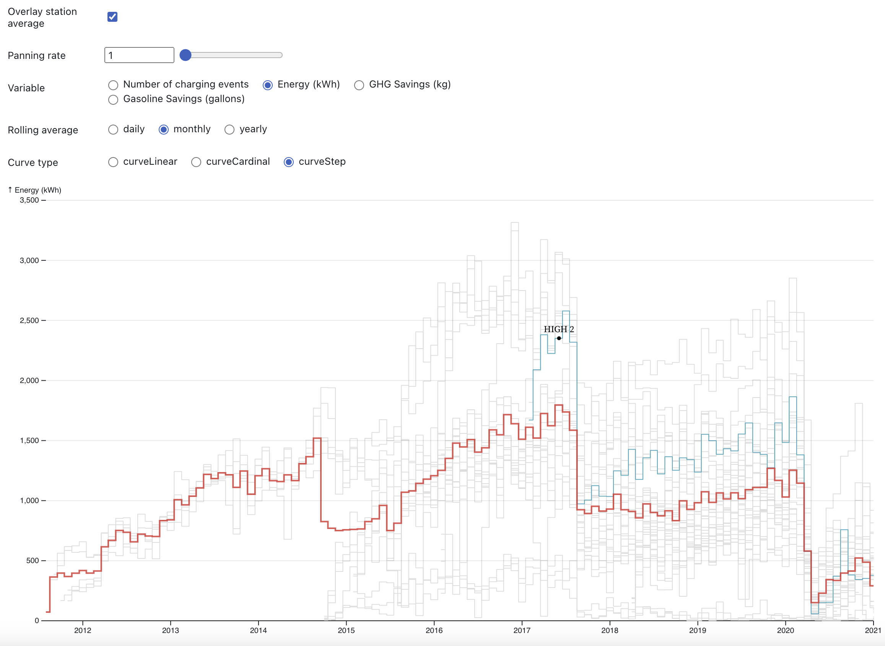

Hey, think of electric vehicle charging stations (EVCS) as these cool hubs that keep our electric cars charged up and ready to roll all day long. Absolutely, ensuring our electric rides get a smooth charge is top priority, especially with more folks zipping around town in EVs. According to a CNBC report, over half of all new cars sold in the U.S. by 2030 are expected to be electric vehicles, which could put a major strain on our nation’s electric grid. We want everyone to enjoy their drive without stressing over running out of energy, don't we?

So, to keep the EV party going strong, it's essential to predict how much energy these charging stations are going to need. This not only ensures the reliability of electric vehicle charging but also contributes to the overall stability and sustainability of the power grid. That's where fancy computer models come in! This study dives into using some deep learning models – a mix of naive forecast methods and some smart deep learning ones – to predict exactly how much energy those EV charging stations are going to use up each day. With this info, we can inform the power grid in advance and make sure it generates power that's not too little and not too much - we also don't want to waste it!

## Data
We use the [EV Charging Station Usage Open Data](https://data.cityofpaloalto.org/dataviews/257812/electric-vehicle-charging-station-usage-july-2011-dec-2020/) provided by the city of Palo Alto, California. The dataset spans from July 2011 to July 2020 and includes details on charging station locations, types of charging connectors available, charging session durations, energy consumption, and other relevant metrics. The dataset has been processed and cleaned prior to analysis.

## Method
- Multiple layer perception (MLP): A Multilayer Perceptron (MLP) is a type of artificial neural network consisting of multiple layers of interconnected neurons. It's a classic model capable of learning complex relationships between inputs and outputs, making it suitable for a wide range of prediction tasks.
- Convolutional neural network (CNN): Convolutional Neural Networks (CNNs) are a type of deep learning algorithm. They have been widely used for image recognition tasks because they excel at identifying patterns in spatial data by employing filters that extract features from input images. However, CNNs have also found applications in time series modeling, where they can effectively capture temporal patterns and dependencies within sequential data.
- Long short term memory (LSTM) network: Long Short-Term Memory (LSTM) is a type of recurrent neural network (RNN) architecture designed to capture long-term dependencies in sequential data. In time series modeling, LSTMs excel at tasks such as sequence prediction, anomaly detection, and natural language processing, where they can effectively capture and learn from patterns in sequential data with varying time dependencies.
- DeepAR: DeepAR is a probabilistic forecasting model designed to handle time series data. Developed by Amazon, it is a type of deep learning model for forecasting that builds on autoregressive recurrent neural networks (RNNs) with a focus on probabilistic predictions. One advantage of DeepAR is that it can work with datasets containing multiple time series that may have different patterns or structures. It leverages similarities across different time series to improve forecasting performance.
- DeepFactor: DeepFactor is a probabilistic model designed for time series forecasting that combines global and local components. It learns a shared global model across multiple time series while also capturing individual series-specific patterns. This makes DeepFactor particularly useful for handling diverse time series data with varying dynamics. It's effective for time series modeling because it balances global trends and local nuances, providing accurate forecasts even when series have unique behaviors.
- Gaussian Process (GP): A Gaussian Process (GP) is a non-parametric, probabilistic model used for time series forecasting and regression. It's particularly effective for time series because it captures complex patterns and provides uncertainty estimates for predictions. GPs are good for time series modeling due to their flexibility, ability to model non-linear relationships, and built-in confidence intervals, making them ideal for capturing temporal dynamics and forecasting with quantified uncertainty.
- Transformer: Transformers are deep learning models originally designed for natural language processing but have been adapted for time series forecasting. They use self-attention mechanisms to capture long-range dependencies and complex patterns in time series data. Transformers are advantageous for time series modeling because they handle long sequences efficiently, can capture intricate temporal relationships, and are highly scalable, making them suitable for tasks involving large datasets or multiple time series.

## Descriptive analysis
See this [Observable blog](https://observablehq.com/d/816825cca1d8ae50) where I made some interactive visualizations, observing the nature of the dataset.

## Modeling results
We plotted out the comparison between real data and prediction data, and the aggregated evaluation metrics are summarized in Table 1. The results show that our baseline model, MLP is good at capturing the overall trend, but not the highest/lowest energy demand.

In comparison, DeepAR accurately detected the energy consumption drop in the beginning of 2020.

| Model/Metrics | MSE | MASE | MSIS | RMSE | wQuantileLoss(0.1)| wQuantileLoss(0.5) | wQuantileLoss(0.9) |
|---------------|-----|------|------|------|-------------------|--------------------|--------------------|
| MLP           | 774.47 | 3.19 | 26.58 | 27.82 | 0.35 | 0.77 | 0.38 |
| GP            | 658.65 | 2.95 | 18.54 | 25.66 | 0.35 | 0.73 | 0.32 |
| DeepFactor    | 324.88 | 1.68 | 21.94 | 18.02 | 0.13 | 0.42 | 0.38 |
| DeepAR        | 297.25 | 1.60 | 19.31 | 17.24 | 0.13 | 0.40 | 0.35 |
| Transformer   | 221.70 | 1.36 | 14.10 | 14.88 | 0.13 | 0.34 | 0.25 |

